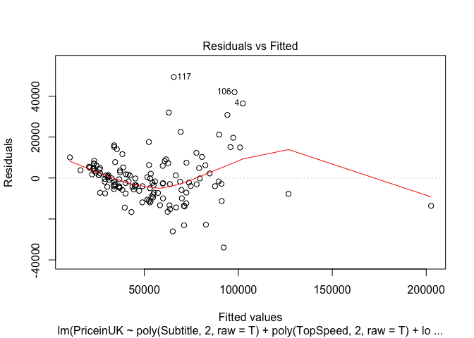
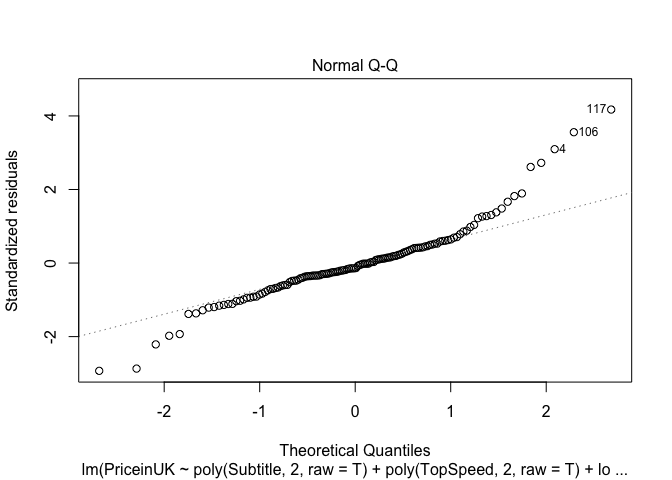
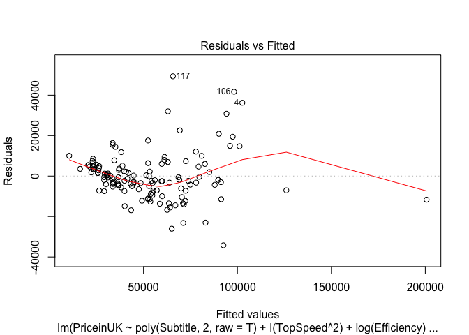
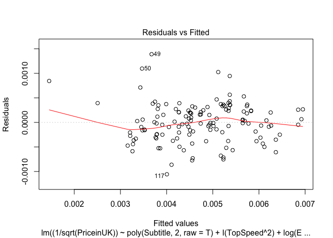
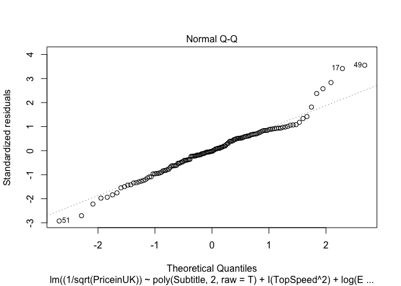
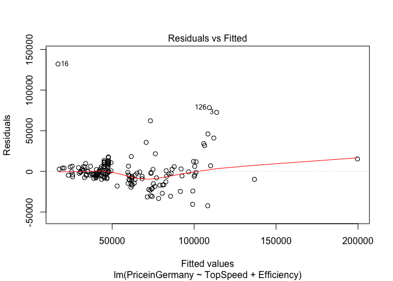

Draft
================
2022-04-19

``` r
library(car)
```

    ## Loading required package: carData

``` r
library(dplyr)
```

    ## 
    ## Attaching package: 'dplyr'

    ## The following object is masked from 'package:car':
    ## 
    ##     recode

    ## The following objects are masked from 'package:stats':
    ## 
    ##     filter, lag

    ## The following objects are masked from 'package:base':
    ## 
    ##     intersect, setdiff, setequal, union

``` r
library(ggplot2)
library(knitr)
library(magrittr)
library(tidyr)
```

    ## 
    ## Attaching package: 'tidyr'

    ## The following object is masked from 'package:magrittr':
    ## 
    ##     extract

``` r
data <- "Dataset/cleaned_data.csv" %>%
  read.csv
```

This document is meant to draft out stuff and select variables.

# Correlation Matrix

First, variables will need to be selected. In order to do this, a
correlation matrix will be used to pick which variables will be kept
before doing linear regression. For our purposes, we will define highly
correlated as having an absolute correlation higher than 0.7.

``` r
data %>%
  select_if(is.numeric) %>%
  cor(use = "pairwise.complete.obs") %>%
  kable
```

|                 |   Subtitle | Acceleration |   TopSpeed |      Range | Efficiency | FastChargeSpeed | NumberofSeats | PriceinGermany |  PriceinUK |
|:----------------|-----------:|-------------:|-----------:|-----------:|-----------:|----------------:|--------------:|---------------:|-----------:|
| Subtitle        |  1.0000000 |   -0.6229854 |  0.6914155 |  0.8900925 |  0.3564261 |       0.6242536 |     0.1344473 |      0.6532906 |  0.7172076 |
| Acceleration    | -0.6229854 |    1.0000000 | -0.8210411 | -0.7120771 |  0.1409840 |      -0.7305042 |     0.3183015 |     -0.5558902 | -0.6643481 |
| TopSpeed        |  0.6914155 |   -0.8210411 |  1.0000000 |  0.7603190 | -0.0473835 |       0.7669064 |    -0.2425673 |      0.7533304 |  0.8577265 |
| Range           |  0.8900925 |   -0.7120771 |  0.7603190 |  1.0000000 | -0.0722725 |       0.7424490 |    -0.0688511 |      0.6247187 |  0.6866690 |
| Efficiency      |  0.3564261 |    0.1409840 | -0.0473835 | -0.0722725 |  1.0000000 |      -0.0961505 |     0.6024685 |      0.2435185 |  0.3375505 |
| FastChargeSpeed |  0.6242536 |   -0.7305042 |  0.7669064 |  0.7424490 | -0.0961505 |       1.0000000 |    -0.2456947 |      0.6045257 |  0.6505508 |
| NumberofSeats   |  0.1344473 |    0.3183015 | -0.2425673 | -0.0688511 |  0.6024685 |      -0.2456947 |     1.0000000 |     -0.0460184 | -0.0597642 |
| PriceinGermany  |  0.6532906 |   -0.5558902 |  0.7533304 |  0.6247187 |  0.2435185 |       0.6045257 |    -0.0460184 |      1.0000000 |  0.9846736 |
| PriceinUK       |  0.7172076 |   -0.6643481 |  0.8577265 |  0.6866690 |  0.3375505 |       0.6505508 |    -0.0597642 |      0.9846736 |  1.0000000 |

From this matrix, we can see that `PriceinUK` is highly correlated with
the following:

-   `Subtitle`

-   `TopSpeed`

-   `PriceinGermany`

`PriceinGermany` may be considered a different version of the response,
but `Subtitle` and `TopSpeed` may be significant predictors. For this
reason, other predictors correlated with these may be dropped. These
predictors are:

-   `Range`

-   `Acceleration`

-   `FastChargeSpeed`

# Scatterplot Matrix

Next a scatterplot matrix will be used to find potential
transformations.

``` r
(PriceinUK ~ .) %>%
  pairs(
    data %>%
      select_if(is.numeric) %>%
      select(-c("PriceinGermany", "Range", "Acceleration", "FastChargeSpeed"))
  )
```

<!-- --> In order to
find the appropriate transformations, the first row will be focused on.
This is because it contains `PriceinUK` as the response and the other
variables as a single predictor.

Since `Subtitle` and `TopSpeed` seem to curve upwards, a quadratic
transformation will be used for those.

Since `Efficiency` and `NumberofSeats` seem to have a non-constant
variance, a logistic transformation will be used. Since `NumberofSeats`
is always positive, the transformation `log` will work. In order to find
which logistic transformation, we will have check if `Efficiency` has
non-positive values.

``` r
data %$%
  Efficiency %>%
  min
```

    ## [1] 104

Since the minimum value in `Efficiency` is positive, all values in that
column must be positive. This indicates that the transformation `log`
will work.

# First Model

Now a model will be tested. Initially, a full model will be used and the
`step` function will be used to select significant predictors using the
BIC.

Before we test the model, it may help to subset the data in order to
drop rows with null values for the columns we want.

``` r
lm_data <- data %>%
  select(-c("Acceleration", "Range", "FastChargeSpeed", "PriceinGermany")) %>%
  drop_na()
```

Now that we have the desired subset, we can use it for regression.

``` r
lm1 <- (PriceinUK ~ poly(Subtitle, 2, raw = T) + poly(TopSpeed, 2, raw = T) + log(Efficiency) + log(NumberofSeats) + Drive) %>%
  lm(lm_data) %>%
  step(
    trace = 0,
    k = lm_data %>% nrow %>% log
  )

lm1 %>%
  summary
```

    ## 
    ## Call:
    ## lm(formula = PriceinUK ~ poly(Subtitle, 2, raw = T) + poly(TopSpeed, 
    ##     2, raw = T) + log(Efficiency) + log(NumberofSeats), data = lm_data)
    ## 
    ## Residuals:
    ##    Min     1Q Median     3Q    Max 
    ## -33938  -5941  -1650   4947  49339 
    ## 
    ## Coefficients:
    ##                               Estimate Std. Error t value Pr(>|t|)    
    ## (Intercept)                 -2.437e+05  4.853e+04  -5.022 1.67e-06 ***
    ## poly(Subtitle, 2, raw = T)1  5.673e+02  1.802e+02   3.148  0.00204 ** 
    ## poly(Subtitle, 2, raw = T)2 -2.321e+00  8.326e-01  -2.788  0.00610 ** 
    ## poly(TopSpeed, 2, raw = T)1 -5.966e+01  1.817e+02  -0.328  0.74314    
    ## poly(TopSpeed, 2, raw = T)2  1.214e+00  3.874e-01   3.132  0.00215 ** 
    ## log(Efficiency)              5.113e+04  8.834e+03   5.788 5.12e-08 ***
    ## log(NumberofSeats)          -1.891e+04  6.457e+03  -2.928  0.00403 ** 
    ## ---
    ## Signif. codes:  0 '***' 0.001 '**' 0.01 '*' 0.05 '.' 0.1 ' ' 1
    ## 
    ## Residual standard error: 12130 on 129 degrees of freedom
    ## Multiple R-squared:  0.8289, Adjusted R-squared:  0.821 
    ## F-statistic: 104.2 on 6 and 129 DF,  p-value: < 2.2e-16

``` r
lm1 %>%
  plot(which = 1:2)
```

<!-- --><!-- -->

In this model, the term `TopSpeed` does not seem to be significant. As
such, a new model without this term will be fit and analyzed. Since the
column `Drive` does not contain null values, we can reuse the same
dataset.

``` r
lm2 <- (PriceinUK ~ poly(Subtitle, 2, raw = T) + I(TopSpeed^2) + log(Efficiency) + log(NumberofSeats)) %>%
  lm(lm_data) %>%
  step(
    trace = 0,
    k = lm_data %>% nrow %>% log
  )

lm2 %>%
  summary
```

    ## 
    ## Call:
    ## lm(formula = PriceinUK ~ poly(Subtitle, 2, raw = T) + I(TopSpeed^2) + 
    ##     log(Efficiency) + log(NumberofSeats), data = lm_data)
    ## 
    ## Residuals:
    ##    Min     1Q Median     3Q    Max 
    ## -34240  -6200  -1488   4869  49331 
    ## 
    ## Coefficients:
    ##                               Estimate Std. Error t value Pr(>|t|)    
    ## (Intercept)                 -2.507e+05  4.343e+04  -5.773 5.42e-08 ***
    ## poly(Subtitle, 2, raw = T)1  5.246e+02  1.245e+02   4.213 4.67e-05 ***
    ## poly(Subtitle, 2, raw = T)2 -2.127e+00  5.828e-01  -3.649  0.00038 ***
    ## I(TopSpeed^2)                1.089e+00  8.033e-02  13.557  < 2e-16 ***
    ## log(Efficiency)              5.147e+04  8.743e+03   5.887 3.16e-08 ***
    ## log(NumberofSeats)          -1.856e+04  6.347e+03  -2.924  0.00408 ** 
    ## ---
    ## Signif. codes:  0 '***' 0.001 '**' 0.01 '*' 0.05 '.' 0.1 ' ' 1
    ## 
    ## Residual standard error: 12090 on 130 degrees of freedom
    ## Multiple R-squared:  0.8288, Adjusted R-squared:  0.8222 
    ## F-statistic: 125.9 on 5 and 130 DF,  p-value: < 2.2e-16

``` r
lm2 %>%
  plot(which = 1:2)
```

<!-- --><!-- -->

This new model only contains significant predictors, however a response
transformation may be needed. In order to check this, the
`powerTransform` function will be used.

``` r
lm2 %>%
  powerTransform %>%
  summary
```

    ## bcPower Transformation to Normality 
    ##    Est Power Rounded Pwr Wald Lwr Bnd Wald Upr Bnd
    ## Y1   -0.4816        -0.5      -0.7586      -0.2047
    ## 
    ## Likelihood ratio test that transformation parameter is equal to 0
    ##  (log transformation)
    ##                            LRT df       pval
    ## LR test, lambda = (0) 11.66524  1 0.00063679
    ## 
    ## Likelihood ratio test that no transformation is needed
    ##                            LRT df       pval
    ## LR test, lambda = (1) 106.0431  1 < 2.22e-16

This indicates that an inverse square root transformation may be
appropriate. A new version of the model with this transformation will be
used and analyzed.

``` r
lm3 <- (
  (1 / sqrt(PriceinUK)) ~
    poly(Subtitle, 2, raw = T) +
    I(TopSpeed^2) +
    log(Efficiency) +
    log(NumberofSeats)
  ) %>%
  lm(lm_data) %>%
  step(
    trace = 0,
    k = lm_data %>% nrow %>% log
  )

lm3 %>%
  summary
```

    ## 
    ## Call:
    ## lm(formula = (1/sqrt(PriceinUK)) ~ poly(Subtitle, 2, raw = T) + 
    ##     I(TopSpeed^2) + log(Efficiency), data = lm_data)
    ## 
    ## Residuals:
    ##        Min         1Q     Median         3Q        Max 
    ## -1.057e-03 -2.494e-04 -1.008e-05  2.503e-04  1.390e-03 
    ## 
    ## Coefficients:
    ##                               Estimate Std. Error t value Pr(>|t|)    
    ## (Intercept)                  1.811e-02  1.440e-03  12.577  < 2e-16 ***
    ## poly(Subtitle, 2, raw = T)1 -4.760e-05  3.993e-06 -11.920  < 2e-16 ***
    ## poly(Subtitle, 2, raw = T)2  2.024e-07  1.909e-08  10.607  < 2e-16 ***
    ## I(TopSpeed^2)               -2.913e-08  2.569e-09 -11.340  < 2e-16 ***
    ## log(Efficiency)             -1.939e-03  2.834e-04  -6.842  2.7e-10 ***
    ## ---
    ## Signif. codes:  0 '***' 0.001 '**' 0.01 '*' 0.05 '.' 0.1 ' ' 1
    ## 
    ## Residual standard error: 0.0004007 on 131 degrees of freedom
    ## Multiple R-squared:  0.8606, Adjusted R-squared:  0.8563 
    ## F-statistic: 202.2 on 4 and 131 DF,  p-value: < 2.2e-16

``` r
lm3 %>%
  plot(which = 1:2)
```

<!-- --><!-- -->

This process has resulted in the following model:

$$
\\begin{align\*}
\\frac{1}{\\sqrt{\\texttt{PriceinUK}}} = & \\beta_0\\\\
+& \\beta_1 \\texttt{Subtitle} \\\\
+& \\beta_2 \\texttt{Subtitle}^2 \\\\
+& \\beta_3 \\texttt{TopSpeed}^2 \\\\
+& \\beta_4 \\ln \\texttt{Efficiency} \\\\
+& \\beta_5 \\ln \\texttt{NumberofSeats} \\\\
+& \\epsilon
\\end{align\*}
$$

# Alternative Model

It is important to note that there is an alternative response in the
dataset: `PriceinGermany`. The same process will be repeated as with
`PriceinUK`.

## Scatterplot Matrix

``` r
(PriceinGermany ~ .) %>%
  pairs(
    data %>%
      select_if(is.numeric) %>%
      select(-c("PriceinUK", "Range", "Acceleration", "FastChargeSpeed"))
  )
```

<!-- -->

Apart from `NumberofSeats`, there seems to be a positive linear
relationship with the response and `Subtitle` and `TopSpeed`.
`PriceinGermany` and `Efficiency` seems to have a positive relationship,
but not a constant variance.

## Alternative Reduced Model

In order to get the desired subset, we will drop the null values from
the desired columns.

``` r
lm_data2 <- data %>%
  select(-c("Acceleration", "Range", "FastChargeSpeed", "PriceinUK")) %>%
  drop_na()
```

Now the full alternative model will be fit.

``` r
lm4 <- (PriceinGermany ~ Subtitle + TopSpeed + Efficiency + NumberofSeats + Drive) %>%
  lm(lm_data2) %>%
  step(
    trace = 0,
    k = lm_data2 %>% nrow %>% log
  )

lm4 %>%
  summary
```

    ## 
    ## Call:
    ## lm(formula = PriceinGermany ~ TopSpeed + Efficiency, data = lm_data2)
    ## 
    ## Residuals:
    ##    Min     1Q Median     3Q    Max 
    ## -42290  -7658  -1972   5802 132089 
    ## 
    ## Coefficients:
    ##               Estimate Std. Error t value Pr(>|t|)    
    ## (Intercept) -101515.26   11255.42  -9.019 4.65e-16 ***
    ## TopSpeed        590.17      35.25  16.741  < 2e-16 ***
    ## Efficiency      287.50      45.63   6.301 2.58e-09 ***
    ## ---
    ## Signif. codes:  0 '***' 0.001 '**' 0.01 '*' 0.05 '.' 0.1 ' ' 1
    ## 
    ## Residual standard error: 19440 on 165 degrees of freedom
    ## Multiple R-squared:  0.6514, Adjusted R-squared:  0.6472 
    ## F-statistic: 154.2 on 2 and 165 DF,  p-value: < 2.2e-16

``` r
lm4 %>%
  plot(which = 1:2)
```

<!-- --><!-- -->

Since the Residuals vs Fitted Values plot seems to fan out, there also
does not seem to be a constant variance. This indicates that not all of
the assumptions are met.

## Possible Transformations

We now use box-cox to find a transformation of the response.

``` r
lm4 %>%
  powerTransform %>%
  summary
```

    ## bcPower Transformation to Normality 
    ##    Est Power Rounded Pwr Wald Lwr Bnd Wald Upr Bnd
    ## Y1   -0.2331       -0.33      -0.4386      -0.0275
    ## 
    ## Likelihood ratio test that transformation parameter is equal to 0
    ##  (log transformation)
    ##                            LRT df     pval
    ## LR test, lambda = (0) 5.008578  1 0.025222
    ## 
    ## Likelihood ratio test that no transformation is needed
    ##                            LRT df       pval
    ## LR test, lambda = (1) 134.5368  1 < 2.22e-16

This seems to indicate that an inverse cube root transformation may
help.
